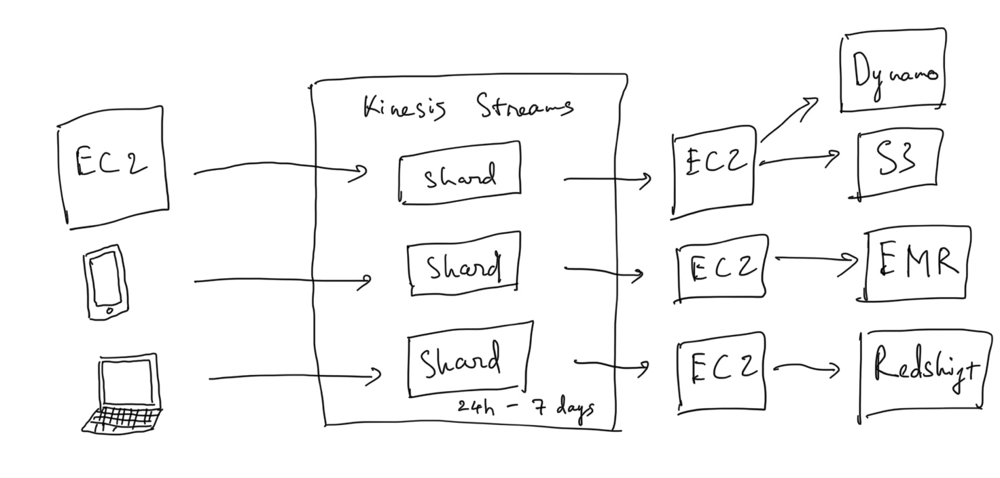
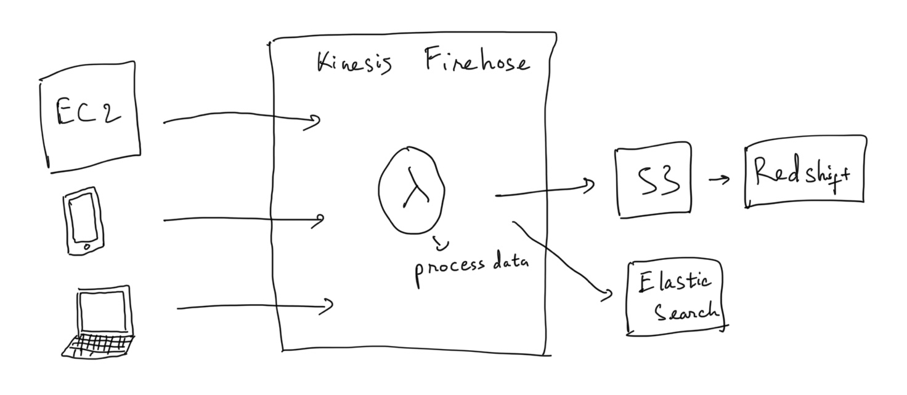
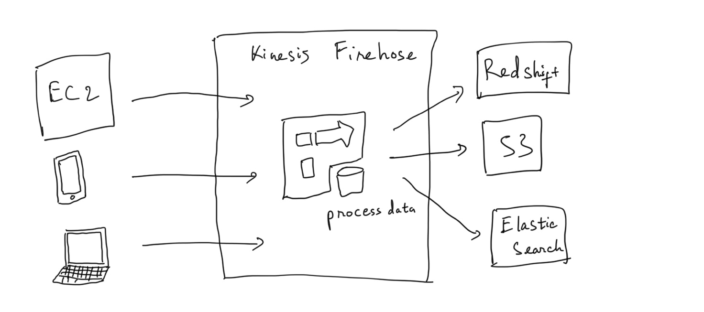
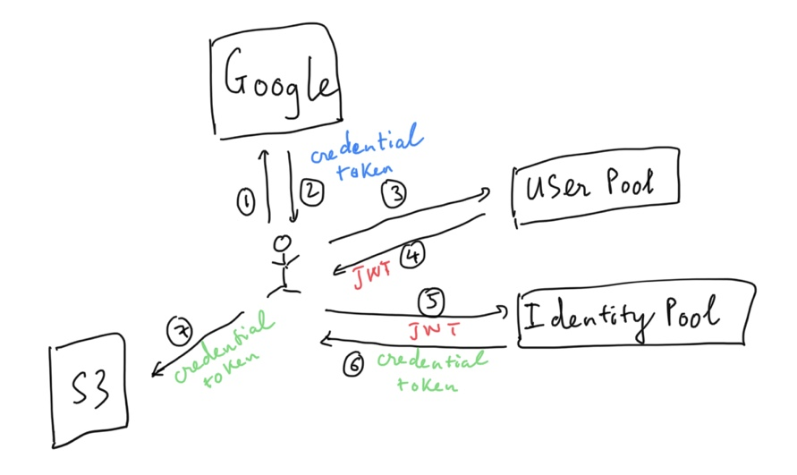
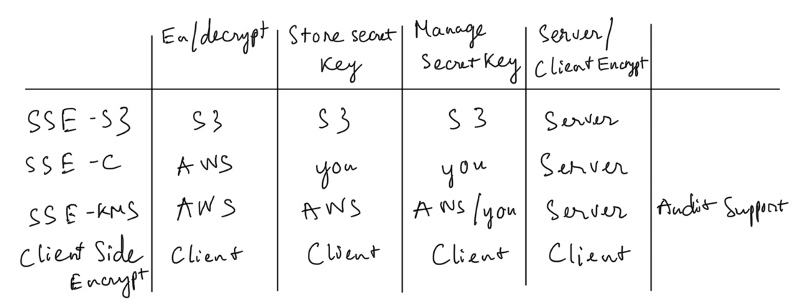

# Appications

## Simple Queue Service (SQS)

### SQS standard (offers as the default queue type)

- nearly-unlimited number of transactions per second
- message is delivered at least once (more than one copy of a message might be delivered out of order)

    

### FIFO queue

- message is delivered once (remain until a consumer processes and deletes it)
- 300 transactions per second

    

### Tips

- SQS is pull based, not pushed based
- messages are 256KB in size
- messages can be kept in the queue from 1 minute to 14 days, the default retention period is 4 days
- VisibilityTimeout: the amount of time that the message is invisible in the SQS queue after a reader picks up that message. Provided the job is processed before the visibility time out expires, the message will then be deleted from the queue. If the job is not processed within that time, the message will become visible again and another reader will process it. This could result in the same message begin deliverd twice
    - Visibility timeout maximum is 12 hours
- DelaySeconds: when a new message is added to the SQS queue, it will be hidden from consumer instances for a fixed period
- SQS long polling is a way to retrieve messages from your Amazon SQS queues. While the regular short polling returns messages immediately (even if the message queue being polled is empty), long polling doesn't return a response until a message arrives in the message queue, or the long poll times out ⇒ **save money**
    - WaitTimeSeconds + ReceiveMessageWaitTimeSeconds: when the consumer instance polls for new work, the SQS service will allow it to wait a certain time for one or more message to be available before closing the connection (if is 0 ⇒ short polling)

## Simple Workflow (SWF)

### SQS vs SWF

SWF

- retention period 1 year
- task-oriented API
- task is assigned only once and is never duplicated

- keep track all the task and event

SQS

- 14 days
- message-oriented API
- need to handle duplicated messages and ensure that a message is processed only once
- need to implement your own application-level tracking, especially if you use multiple queues

### SWF Actors

- workflow starter - initiate workflow
- decider - control the flow of activity tasks
- activity worker - carry out the activity tasks

## Simple Notification Service (SNS)

### SNS Benefits

- push-based delivery (not pull based)
- simple APIs, easy integration
- flexible message delivery over multiple transpot protocols
- inexpensive, pay-as-you-go
- web-based AWS Management Console offers the simplicity of a point-and-click interface

## Elastic Transcoder

- Media Transcoder in the cloud
- Convert media files from their original source format in to different formats that will play on smartphones, tablets, PCs
- provide transcoding presets for popular output format
- pay based on the minutes that you transcode and th resolution at which you transcode

## API Gateway

- API Gateway is at a high level
- API Gateway has caching capabilities to increase performance
- API Gateway is low cost and scales automatically
- can throttle API Gateway to prevent attacks
- can log results to CloudWatch
- enable CORS on API Gateway to use Javascipt communicate with multiple domains
- CORS is enforced by the client
- See more: [CORS - Cross Same Origin Policy](https://www.notion.so/CORS-Cross-Same-Origin-Policy-98390b3dd7554abcbad0a53485ee75d9)

## Kinesis

A platform on AWS to send your streaming data to

### Kinesis Streams

- data is persistance in 24 hour (up to 7days)
- consist of shards:
    - 5 transactions/second for reads, maximum total data read: 2MB/second
    - 1000 records/second for writes, maximum total data write: 1MB/second (including partition keys)
    - total capacity of the stream is the sum of the capacities of itss shards

    

### Kinesis Firehose

- no persistent storage (data has to be processed when it come in using lambda)

### Kinesis Analytics

- analyze the data on the fly inside either service

## Cognito - Web identity Federation

- let your users access to AWS resources after they have authenticated with a identity provider like Amazon, Facebook, Google
- sign up and sign in to your apps
- access for guest users
- act as an Identity Broker between your app and Web ID provider
- synchronize user data for multiple devices
- recommend for all mobile app AWS services

### User Pools

- for authentication purpose
- manage sign-up sign-in functionality for mobile and web app
- can sign-in directly (use email, password) or use Facebook, Amazon, Google

### Identity Pools

- for authorization purpose
- provide temporary AWS credentials to access AWS services like S3 or DynamoDB

## Key Management Service (KMS)

Compare with other encrypt service 

