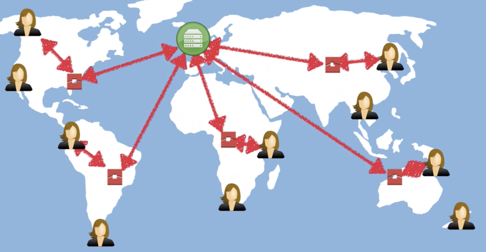

# CloudFront

A content delivery network (CDN) is system of distributed servers (network) that deliver webpages and other web content to a user based on the geograpich locations of the user, the origin of the webpage, and a content delivery server.

## Summary
- Edge Location - This is the location where content will be cached. This is separate to an AWS Region
- Origin - This is the origin of all the files that the CDN will distribute. This can be either an S3 Bucket, an EC2 Instance, an Elastic Load Balancer or Route53
- Distribution - This is the name given the CDN which consists of a colleciton of Edge Locations
- Web Distribution - Typically used for Websites
- RTMP - Used for Media Streaming
- Edge locations are not just READ only - you can write to them too (eg: put an object to them)
- Objects are cached for the life of the TTL (Time To Live)
- Can clear cached objects, but will be charged

## CloudFront vs S3  Transfer Acceleration

S3 Transfer Acceleration optimizes the TCP protocol and adds additional intelligence between the client and the S3 bucket, making **S3 Transfer Acceleration** a better choice if a **higher throughput** is desired. If you have objects that are **smaller than 1GB** or if the data set is less than 1GB in size, you should consider using **Amazon CloudFront**'s PUT/POST commands for optimal performance.
