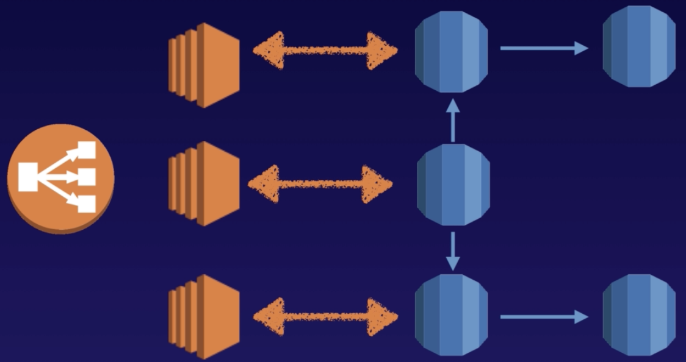
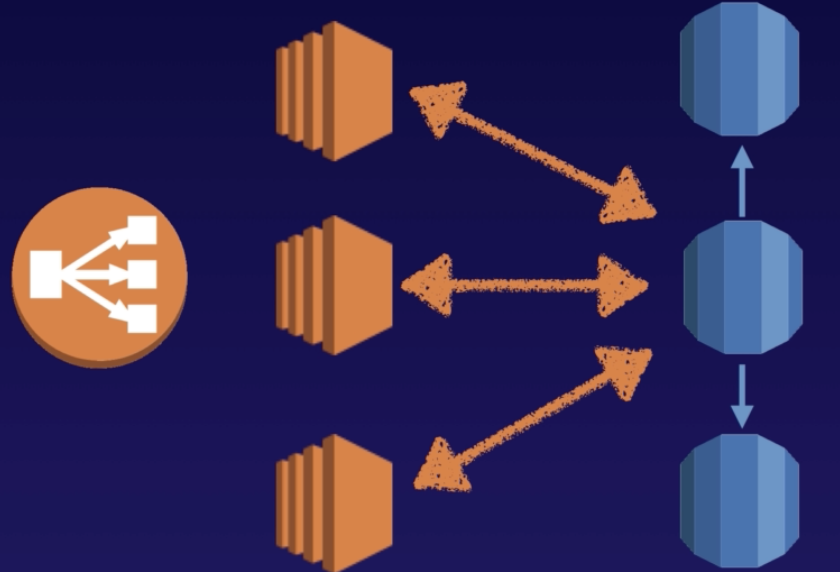
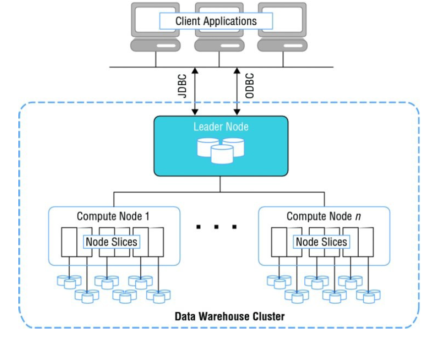

# Database

## DB Sercurity (RDS, Redshift, Aurora)

- infrastructure resources (IAM)
- database level (set up permisstion for database's user)
- record level (encrypt to protect data at rest (KMS...), use SSL/HTTPS to protect data in transit )
- network level (Use VPC, security group (for database deploy with EC2))

## RDS

- RDS runs on virtual machines
- cannot log in to these operating systems
- RDS is not serverless, however **Aurora is Serverless**
- Online Transaction Processing (OLTP) (OLAP Online Analytics Processing - Redshift)
- once rds instance is encrypted (use KMS - Amazon Key Management Service or TDE - Transparent Data Encryption), automated backups, read replicas, snapshots is also encrypted
- **DB parameter groups**: act as a container  for engine configuration, can apply to one or more DB instances (can change db parameter groups of instance but reboot is required)
- **DB option groups**: act as a container for engine features
- **RPO - Recovery Point Objective** the maximum period of data loss that is acceptable in the event of failure
- **RTO - Recovery Time Objective** the maximum amount of downtime that is permitted to recover from backup and to resume processing
- **License Included:**  Oracle Standard One, SQL Server Express, SQL Server Web
- **Bring You Own License:** Oracle all edition (standard one, standard, enterprise), SQL Server Standard, SQL Server Enterprise

### Back ups

- automated backups
    - enabled by default
    - backup data is stored in s3 and storage space is free
    - is deleted after delete the original RDS instance
- database snapshots
    - do manually
    - is stored even after delete the original RDS instance
- while backup the database, storage I/O may be suspended ⇒ use Multi-AZ
- when restore the database, we will get a new RDS instance with a new DNS endpoint
- when restore the database, only the default **DB parameter** and **security groups** are associated with the restored instance (can change that after the restore is completed)

### Multi-AZ

- copy database in another AZ
- **for Disaster Recovery only** (availability, failover) **(**want to improve performance ⇒ use Read Replicas)
- can force a failover from 1 AZ  to another by rebooting rds instance

### Read Replica

- **Used for scaling**, increase performance, not for Disaster Recovery
- must have automatic backups turned on
- can have up to 5 read replica copies of any database
- can have read replicas of read replicas (but watch out for latency)
- each read replica has its own DNS end point
- can have read replicas that have Multi-AZ
- can create read replicas of Multi-AZ soure db
- can be promoted to master. This breaks the replication
- **can have a read replica in different regions**
- replica can be mysql, postgre, mariaDB, Oracle, Aurora (except sql server)
- Use case:
    - for read-heavy workloads
    - handle read traffic while the source DB Instance is unavailable (Eg. due to I/O suspension for backups or scheduled maintenance)
    - handle offload reporting or data warehouse scenarios instead of the primary DB Instance

## DynamoDB

- Stored on SSD storage
- Spread across 3 geographically  distinct data centers
- Eventual Consistent Reads is default (read data after write within 1 second)
- can use Strong consistent read (read data after write less than 1 second), but not recommend
- Each table in DynamoDB is limited to 20 global secondary indexes (default limit) and 5 local secondary indexes.
- The maximum item size in DynamoDB is 400 KB

## Redshift

- Enabled by default with a 1 day retention period (maximum is 35 days)
- always maintain at least 3 copies of your data (the original, replica on the compute nodes and a backup in S3)
- can asynchronously replicate your snapshots to S3 in another region for disaster recovery
- backups:
    - auto backup
    - manual backup

## Aurora

- 2 copies of your data is contained in each availability zone, with minimum of 3 availability zones. 6 copies of your data
- can share Aurora Snapshots with other AWS accounts
- 2 types of replicas available
    - Aurora Replicas ⇒ automated failover
    - MySQL replicas
- have up to 15 Aurora Replicas
- automated backups turned on by default
- migrate from MySQL to Aurora
    - create read replica ⇒ promote it
    - create a snapshot ⇒ restore from that snapshot

## Elasticache

- use to increase database and web application performance
- 2 type
    - Redis
        - Multi-AZ
        - can backup and restore
    - Memcached
        - scale horizontally