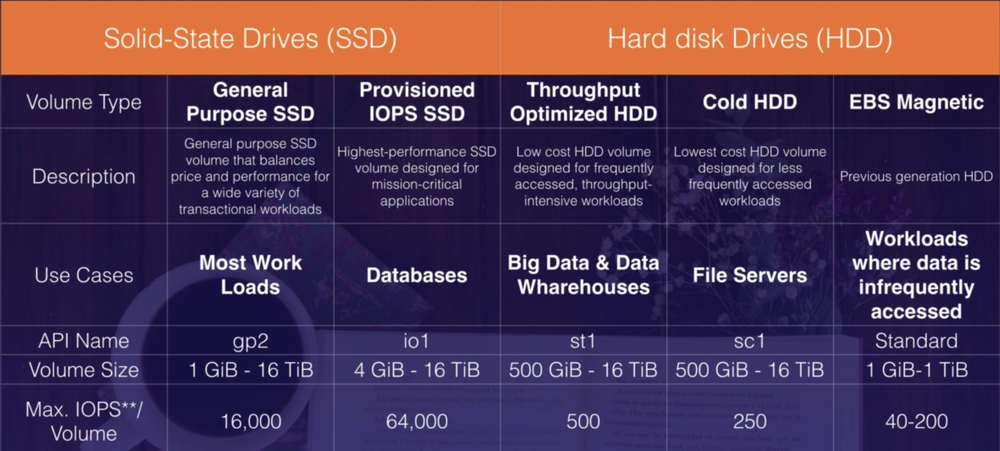

# EC2, CloudWatch, CloudTrail

SSH to EC2 instance and request to [http://169.254.169.254/latest/meta-data](http://169.254.169.254/latest/meta-data) for instance's information (public, private IP...)

By default, AWS has a limit of 20 instances per region.

## EC2 Pricing Models

### On Demand

Allows you to pay a **fixed rate** by the **hour** (or by the **second**) with no commitment

⇒ suitable for use cases where you dont want any long term commitment like testing and POCs, **spiky**, unpredictable workloads that cannot be interrupted

### Reserved

Provides you with a capacity reservation, and offer a significant discount on the hourly charge for an instance. Contract Terms are **1 Year** or **3 Year** Terms

- Standard Reserved Instances
    - can change Availability Zone, instance size (for Linux OS), networking type
- Convertible Reserved Instances
    - can change Availability Zone, instance size (for Linux OS), networking type
    - can change instance families, operating system, tenancy, and payment option
- Scheduled Reserved Instances

### Spot

These are unused EC2 instances that can bid for. Once your bid exceeds the current spot price the instance is launched. The instance **can be shuted down anytime** the spot price becomes greater than your bid price.

⇒ providing for even greater saving if your app have flexible start and end times, very low compute prices, urgent computing needs for large amounts of additional capacity, for a workload with several Reserved Instances reading from a queue, can use Spot Instances to alleviate heavy traffic in a cost-effective way

### Dedicated Hosts

Physical EC2 server. reduce costs by allowing to use your existing server-bound **software licenses** (oracle license...) 

- can be purchased on-demand (hourly)
- can be purchased as a reservation

Change Dedicated hosting back to default hosting ⇒ use CLI, SDK, API, stop instance befor change

## EBS

- Termination Protection is turned off by default, you must turn it on
- On an EBS-backed instance, the **default action is for the root EBS volume to be deleted** when the instance is terminated but **any additional volumes by default won't be deleted**
- EBS Root Volumes of your DEFAULT AMI's (amazone machine image) **CAN be encrypted** by use a third party tool or creating AMI's in the aws console or using the API
- Additional volumes can be encrypted

## EC2  Security Groups

- All **Inbound** traffic is **blocked by default**
- All **Outbound** traffic is **allowed by default** (outbound = response of inbound traffic + request to external services)
- Security Groups are **STATEFUL** ⇒ an inbound rule allowing traffic in, that traffic is automatically allowed back out again
- Changes to Security Groups take effect immediately
- n EC2 instances ↔ 1 security group
- 1 EC2 instances ↔ n security group
- cannot block specific IP address using Security Groups (instead use Network Access Control Lists - VPC)
- can specify allow rules, but not specify deny rules
- **combine of multiple security group: (or)** if there is an allow rules, the request is allowed, evaluation stops (no matter other group's rules)

## Volumes, Snapshots

- Volumes exist on EBS ⇒ virtual hard disk
    - Volumes is **always** be in the same AZ as the EC2 instance
    - Can change EBS volume sizes and storage type when it's running
- Snapshots exist on S3 ⇒ photo of the disk
    - Can take a snapshot while the instance is running, **however** should stop the instance before take the snapshot for volumes that serve as root devices ⇒ snapshots will be consistent
    - Snapshots are incremental ⇒ only the blocks that have change since your last snapshot are moved to S3
        - t1 ⇒ snapshot1
        - create file a.txt ⇒ t2 ⇒ snapshot2
        - S3 2 files is storaged: snapshot1, (snapshot2 -snapshot1)

        ⇒ first snapshot may take some time to create

- Snapshots are point in time copies of Volumes
- AMI (amazone machine image) can be created from both Volumes and Snapshots

### **Move an EC2 volumes from one AZ to another**

- take a snapshot
- create an AMI
- launch the EC2 instance in a new AZ (choose subnet of AZ)

### **Move an EC2 volumes from one region to another**

- take a snapshot
- create an AMI
- copy AMI to other region
- launch the EC2 instance by the copied AMI

### Encrypted

- Snapshots of encrypted volumes are encrypted automatically
- Volumes restored from encrypted snapshots are encrypted automatically
- can share snapshots but only if they are unencrypted
- can encrypt root device volumes when create EC2 instance

### Encrypt an unencrypted root device volume

- take a snapshot of the uncrypted root device volume
- copy snapshot and enable encryption
- create an AMI from the encrypted Snapshot
- use that AMI to launch new encrypted instances

### Snapshot ⇒ AMI ⇒ instance

- copy a snapshot can enable **encryption**
- create AMI from a snapshot can only change **virtualization type** (HVM, PV)
- copy AMI can change **region**
- launch instance from an AMI can choose **AZ**

## EBS vs Instance Store

- Instance Store Volumes are also called Ephemeral Storage
    - use case: temporary storage such as buffers, caches, scratch data or data that is replicated across a fleet of instances such as load-balanced pool
    - very cost effective, very high IOPS
    - **require provision** but charge is based on the **hourly cost of instance**
    - Instance store volumes **can't be stopped**. If the host fails ⇒ lose data
- EBS:
    - EBS backed instances **can be stopped**. If instance is stopped ⇒ not lose data
    - **require provision**, charge is based on the total **amount of storage provisioned**
- can reboot both, not lose data
- By default, both Root volumes will be deleted on termination. Can choose option that keep the root device volume backed by EBS volumes.

## IAM Roles With EC2

- Roles are more secure and easier than storing access key and secret access key in EC2 instance
- Roles can be assigned to an EC2 instance after it's created
- Roles are universal - can use in any region

## Elastic File System

- support NFSv4 protocol
- only **pay as you use** (**no pre-provisioning** required)
- can scale up to petabytes
- support thousands of concurrent NFS connections
- storing data across multiple AZ's within a region
- **Read After Write Consistency**

## EC2 Placement Groups

- Clustered Placement Group
    - AWS recommend the same instances within this groups
    - can't span multiple AZ
    - use case: low network latency / high network throughput
- Spread Placement Group
    - Can span multiple AZ
    - maximum of 7 running instances per AZ per group
    - use case: Individual EC2 instances
- Partitioned
    - Can span multiple AZ
    - maximum of 7 partitions per AZ
    - The number of instances that can be launched into a partition placement group is limited only by the limits of your account
    - use case: Multiple EC2 instances HDFS, HBase, Cassandra
- only certain types of instances can be launched in a placement group (compute optimied, gpu, memory optimied, storage optimized)
- can't merge placement groups
- can't move an existing instance into a placement group (can create AMI from existing instance and launch new instance into a placement group)
- no charge for creating a placement group
- name of placement group must be unique within your AWS account

## Things that can be modified after launch

- instance type (size, memory, network...)
- security group ⇒ can be changed if the instance is running in an VPC (default when launch instance)
- termination protection
    - note that termination protection protects from termination calls from AWS Console, CLI, API (human errors), not prevent termination triggered by an OS shutdown command termination from an Auto Scaling group, termination of a Spot Instance (due to Spot price changes)

## Bootstrapping

- allow to run a scripot to initialize your instance with OS configurations, applications