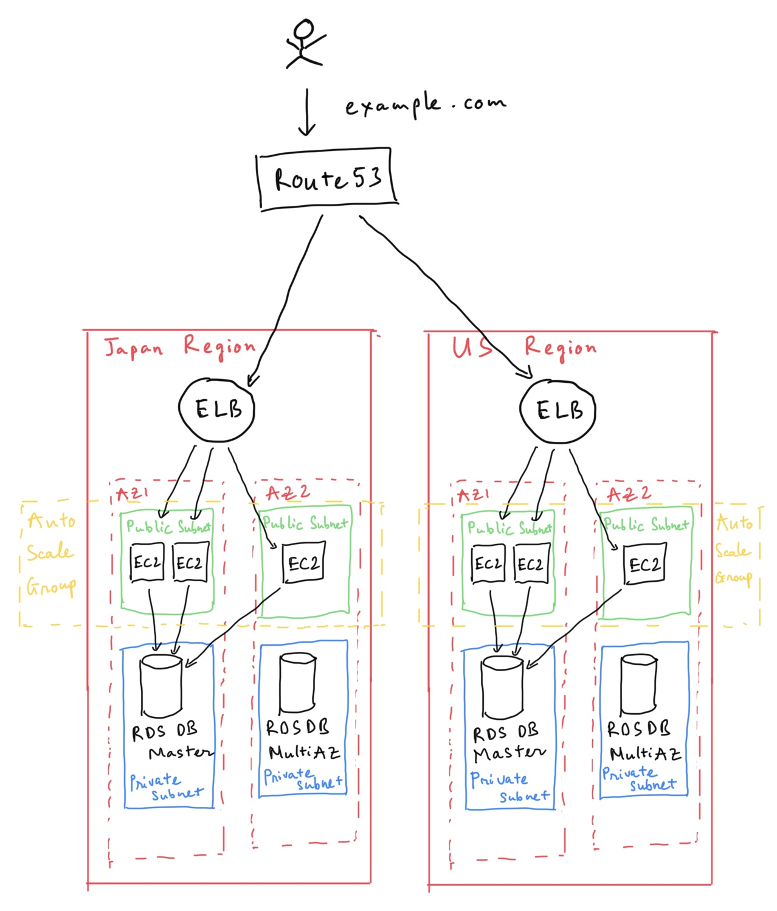
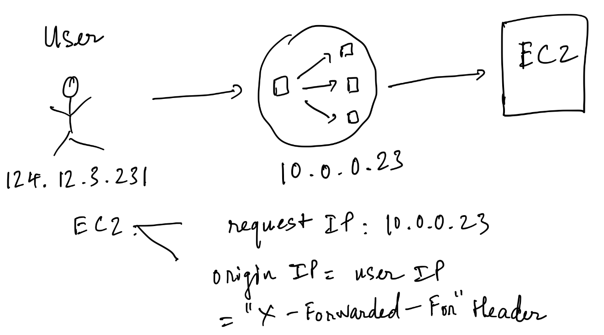
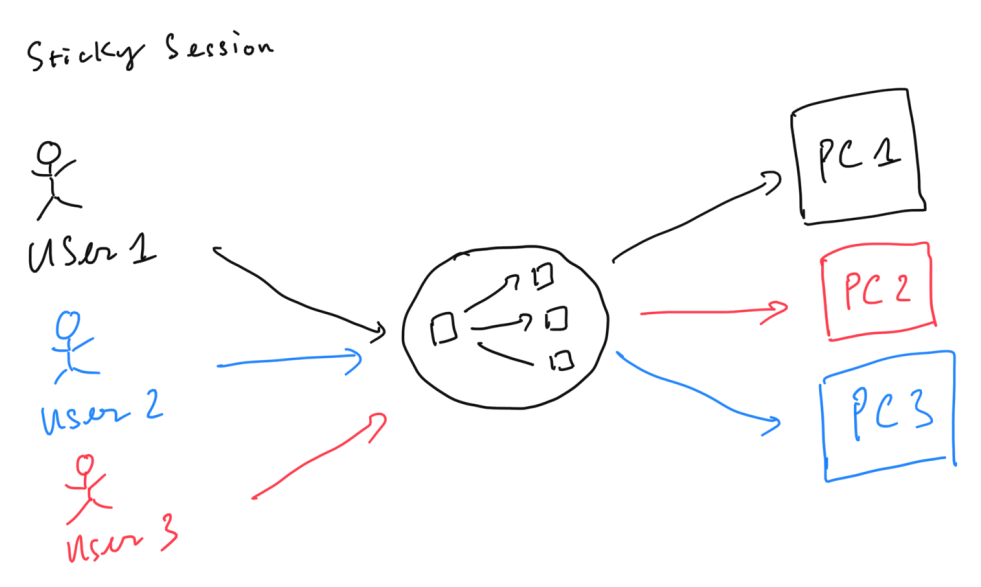
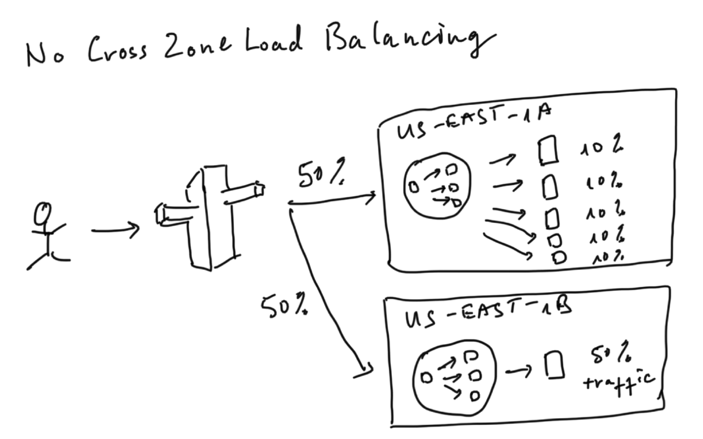
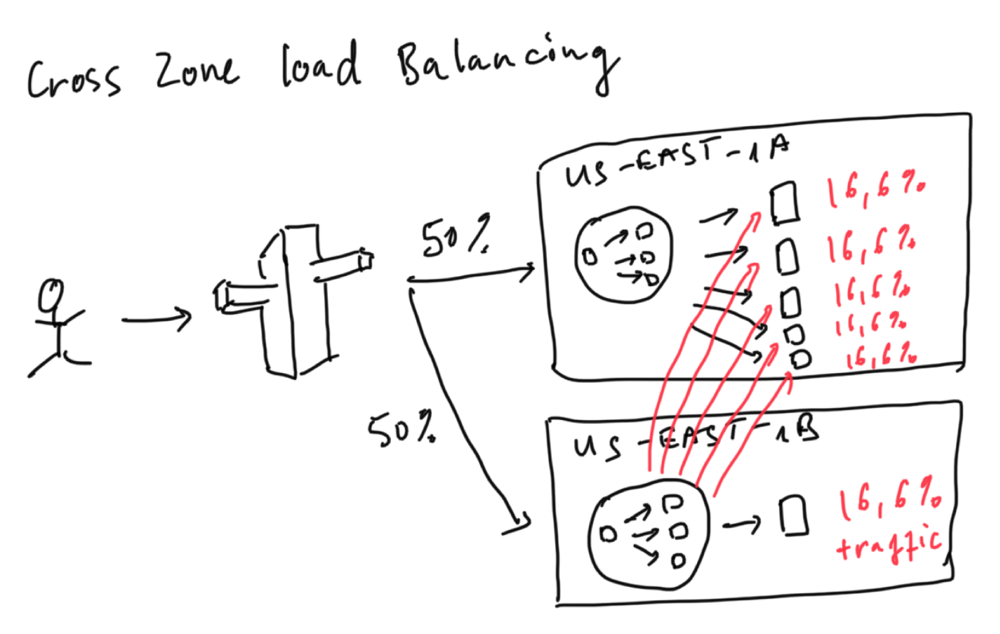
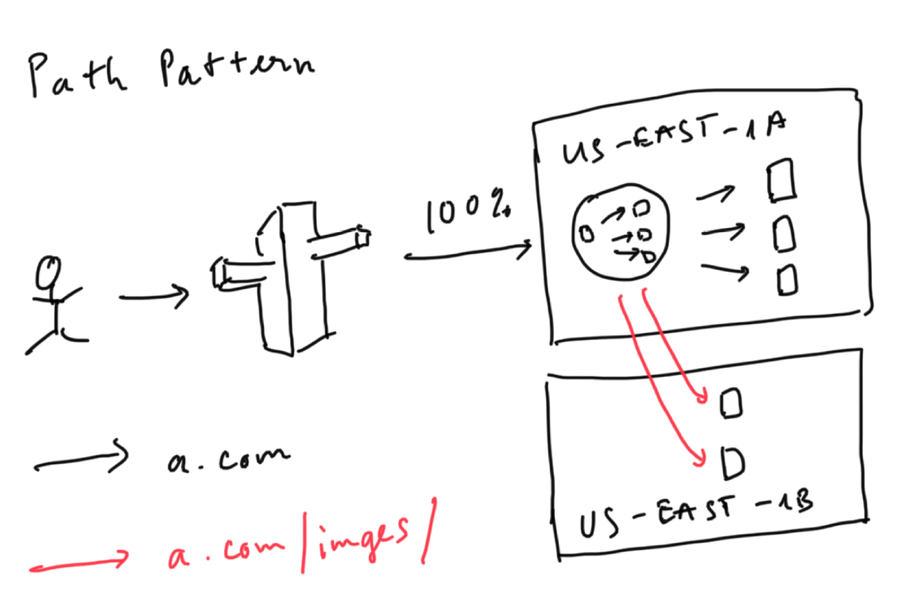

# HA Architecture

## Load Balancers

### Load Balancer types

- **Application Load Balancers** - best suited for load balancing of HTTP and HTTPS traffic, operate at *OSI Layer 7 (Application)* and **are *application-aware*, intelligent, create advanced request routing, sending *specified requests to specific web servers*
- **Network Load Balancers** - best suited for load balancing of TCP traffic where extreme performance is required, operate mostly at the *connection level, OSI Layer 4 (Transport - even though it also supports TLS termination)*, can handling millions of requests per second, while maintaining ultra-low latencies
- **Classic Load Balancers** - legacy Elastic Load Balancers, can use for load balance HTTP/HTTPS applications and use *OSI Layer 7 (Application) - specific features* (X-Forwarded, sticky session), can *strict Layer 4* load balancing for applications that rely purely on the TCP protocol
    - error 504 - time out error ⇒ need to trouble shoot the application failed (web server or database server?)
    - X-Forwarded-For Header

    

    EC2 instance look to X-Forwarded-For header to know origin IP (User IP)

### Tips

- Instances monitored by ELB are reported as: InService, OutOfService
- Health check verify the instance health by talking to it
- Load balances have a dedicated DNS name but no IP address

### Advanced Load Balancer Theory

- Sticky Sessions: enable your users to stick to the same EC2 instance. Useful if you hold user-specific application state on EC2 instances.

- Cross Zone Load Balancing: enable you to load balance across multiple availability zones

- Path patterns: allow you to direct traffic to different EC2 instances based on the URL contained in the request

## Auto Scaling Groups

Steps to create a Auto Scaling Group

1. Launch Configuration (EC2 configuration)
2. Create Auto Scaling Group, can choose *keep this group at its initial size* or *use scaling policies to adjust the capacity of this group* (can scale between x~y number of instances depend on metrics - CPU, Network, Request...)