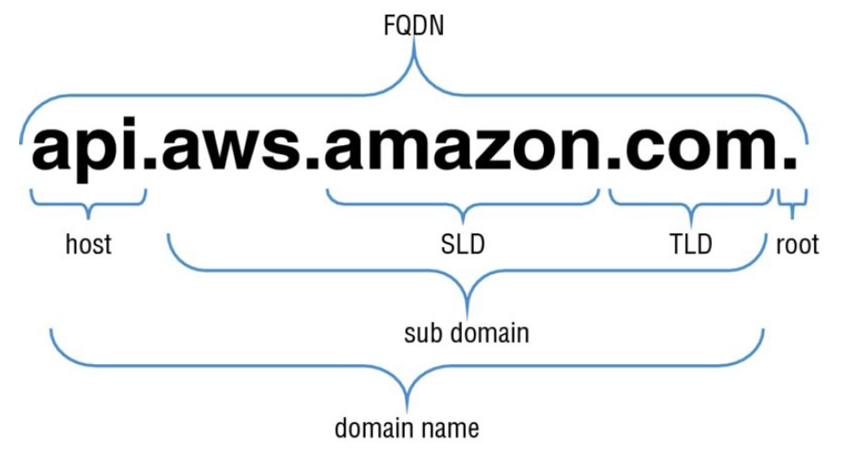
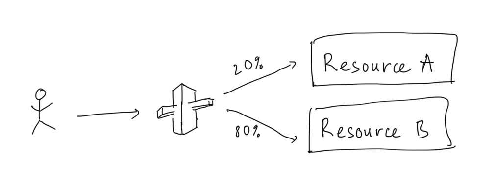
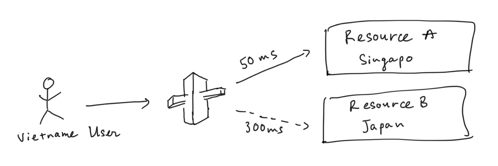
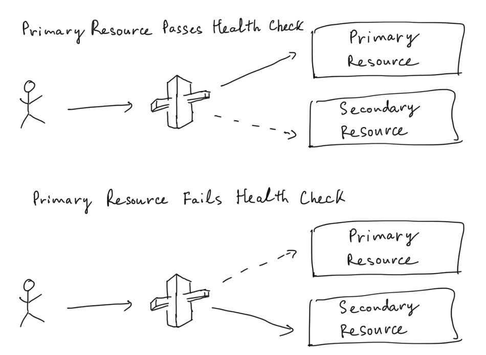
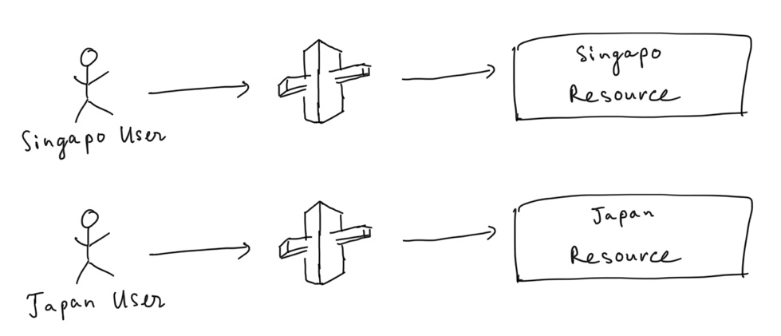
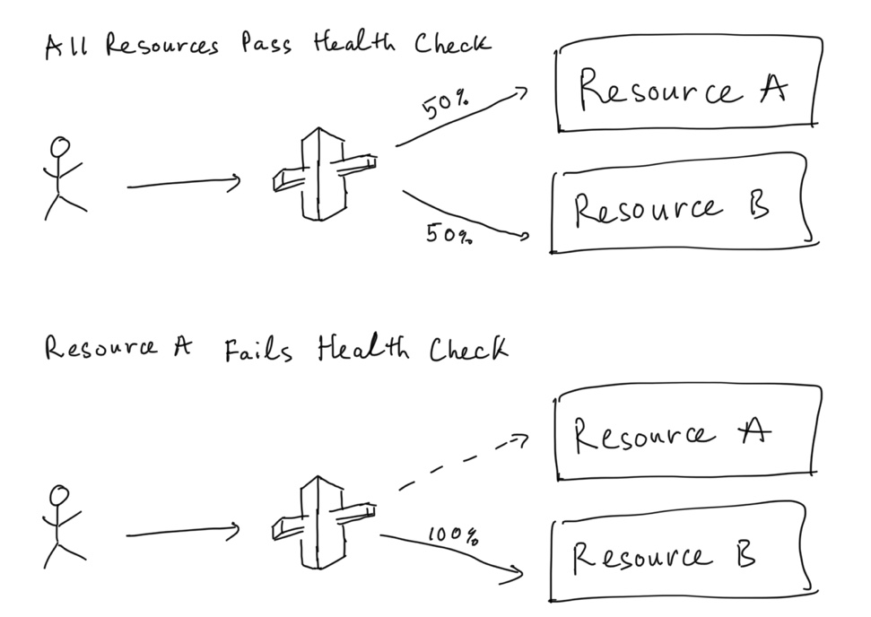

# Route53

## Domain Name System (DNS)

- Map domain to IP address
- Top-Level Domain (TLD): amazon**.com**, .com**.vn**, .com**.uk**
- Second-level domain (SLD): **amazon**.com, **.com**.vn, .**com**.uk

### Hosts

individual hosts refer to separate **computers or services** through a domain

- [example.com](http://example.com) vs www.example.com
- api.example.com, ftp.example.com, files.example.com

### Subdomains

subdomain **extends the parent domain**

- www.history.school.edu

### Full Qualified Domain Name (FQDN)

### Name Servers

A computer designated to translate domain names into IP addresses.

Name servers give answers to queries about domains under their control. Otherwise, they point to other servers or serve cached copies of other name server's data

### Zone Files

Simple text file that contains the mappings between domain names and IP.

Stored in Name Servers

### Top-Level Domain (TLD) Name Registrars

An organization that manages the reservation of Internet domain.

Eg: Vietnam government manages the reservation of **.vn** domain.

### Steps that map domain names with IP address

1. type a domain name into web browser
2. computer checks its host file to see if it has that domain name stored locally

    if not, check DNS cache to see if visited the site before

    if not, contact a DNS server

3. DNS is a hierarchical system with root servers at the top. Root servsers handle requests for information about TLDs. 

## Route53

### Main function

- Domain registration
- DNS service
- Health checking: sends requests automatically to verify application is reachable, available, functional

### Hosted Zones

- collection of resource record sets like a traditional DNS zone file
- 2 types of hosted zones:
    - private: hold information about how to route traffic for a domain within VPC
    - public: hold information about how to route traffic for a domain on the Internet
- the resource record sets contained in a hosted zone must share the same suffix (amazon.com, aws.amazon.com, api.amazon.com, not amazon.jp)

### Health Checks

- can set health checks on individual record sets
- if a record set fails a health check it will be removed from Route53 until it passes the health check
- can set SNS notification if a health check is failed

### Routing Policies

Simple Routing

- 1 record ⇒ n IP
- Route53 returns 1 IP randomly
- cannot do health check with end point

Weighted Routing

- split traffic based on different weights assigned

Latency-based Routing

- route traffic based on the lowest network latency (fastest response time)
- Failover Routing

    

    - When primary end point fails the health check, route traffic to second end point
- Geolocation Routing

    

    - route traffic based on the geographic location of your users
- Geoproximity Routing (Traffic Flow Only)
    - route traffic to resources based on the geographic location of users and resource
    - can route more traffic or less to a given resource by specifying a bias value
    - **must use Route53 traffic flow**
- Multivalue Answer Routing

    

    - similar to simple routing however it allows you to put health checks on each record set

### Tips

- ELBs do not have pre-defined IPv4 addresses, use a DNS name to do that (CNAME)
- difference between an Alias Record and CNAME
- Alias Record is always better than CNAME (CNAME is not allowed for hosted zone in Route53)
- common DNS Types:
    - SOA Records
    - NS Records
    - A Records
    - Cnames
    - MX Record
    - PTR Record
- Can buy domain directly with AWS
- It can take up to 3 days to register domain