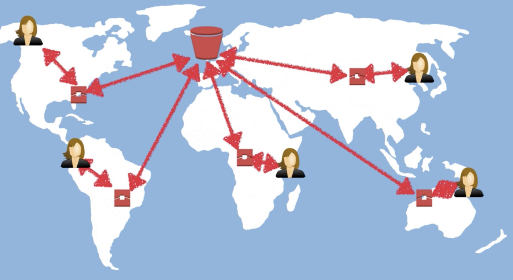

# S3

Even though each bucket is created in specific region, S3 names must be **unique** globally

## S3's Object is consists of the following:
- Key
- Value
- Version ID
- Metadata
- Subresources (Access Control Lists, Torrent)

## Data consistency work for S3:
- Read after Write consistency for PUTS of new Objects
- Eventual Consistency for overwrite PUTS and DELETES

## Features:
- Tiered Storage Available
- Lifecycle Management
- Versioning
- Encryption
- MFA Delete
- **Access Control Lists** and **Bucket Policies**
- can create up to **100 buckets** per count by default
- object's size is from **0 bytes** up to **5TB**
- upload object > 100MB => **should** use multipart upload
- upload object > 5GB => **must** use multipart upload

## S3 Storage Classes (tier)
- S3 Standard (**99.99% availability** 99.999999999% durability )
- S3 - IA (Infrequently Accessed) (**99.9% availability** 99.999999999% durability)
- S3 One Zone - IA (**99.5% availability** 99.999999999% durability )
- S3 - Intelligent Tiering
- S3 Glacier  (Minutes to hours) (**99.99% availability** 99.999999999% durability)
- S3 Glacier Deep Archive (12 hours can acceptable) (**99.99% availability** 99.999999999% durability)

## charged ways:
- Storage
- Requests
- Storage Management Pricing (tier)
- Data Transfer Pricing
- Transfer Acceleration
- Cross Region Replication Pricing

## S3 LifeCycle Management can:
- Automates  moving your objects between the different storage tiers
- can be used in  conjunction with versioning
- can be applied to current versions and previous versions

## Cross Region Replication
- Versioning must be enabled on both the source and destination buckets
- Regions must be unique
- Files in an existing bucket are not replicated automatically (only when add a new file that new file was automatically replicated)
- All subsequent updated files will be replicated automatically
- Delete markers are not replicated
- Deleting individual versions or delete markers will not be replicated

## S3 Transfer Acceleration
Instead of uploading directly to S3 bucket, user can use a distinct URL to upload directly to an edge location which will then transfer that file to S3.

## Access Point
- managing data access at scale for applications using shared data sets on S3
- bucket can have hundreds of access points
- can create an access point for your S3 bucket that grants access for groups of users or applications for your data lake. An Access Point could support a single user or application, or groups of users or applications, allowing separate management of each access point
