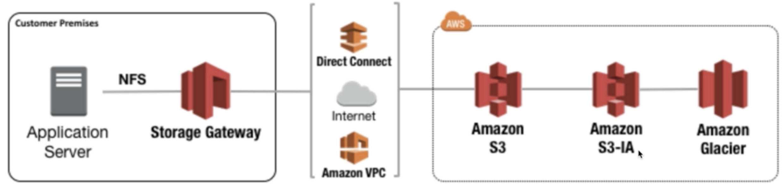
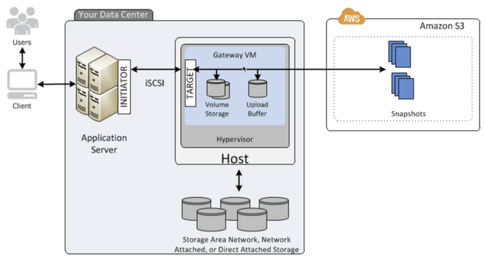
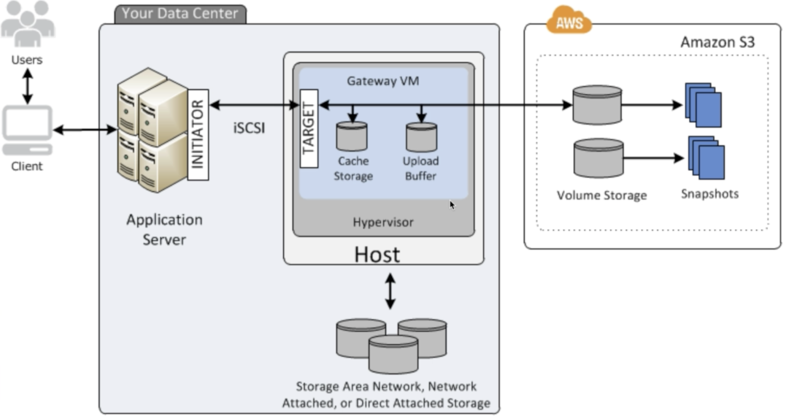
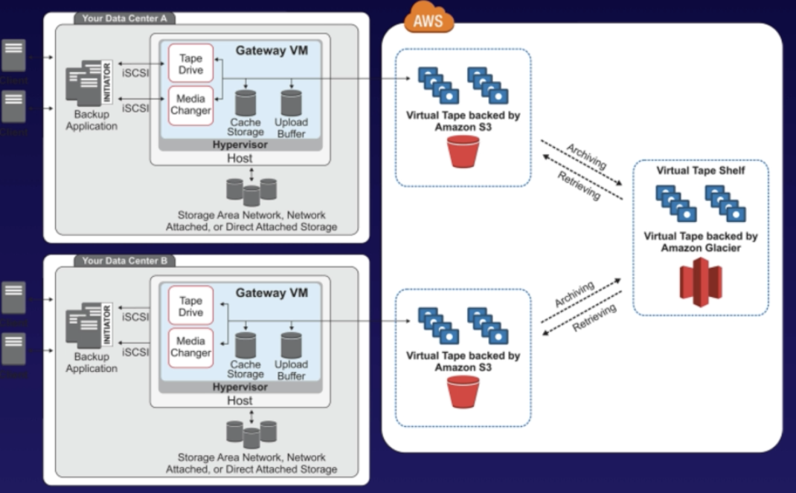

# Snowball

Snowball is a petabyte-scale data transport solution that uses secure appliances to transfer large amounts of data into and out of AWS.

# Storage gateway

- File Gateway
    For flat files, stored directly on S

    

- Volume Gateway
    - Stored Volumes - Entire Dataset is stored on site and is asynchronously backed up to S3

    

    - Cached Volumes - Entire Dataset is stored on S3 and the most frequently accessed data is cached on site

    

- Gateway Virtual Tape Library

