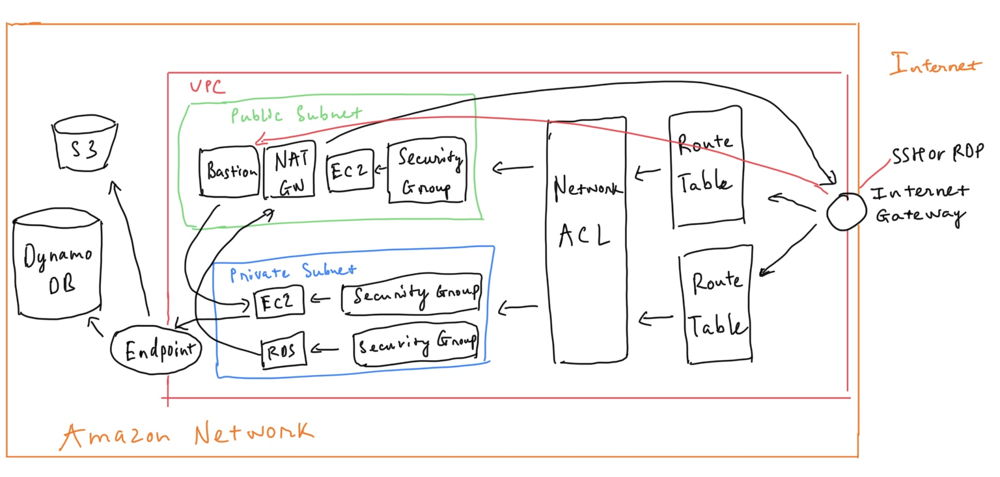
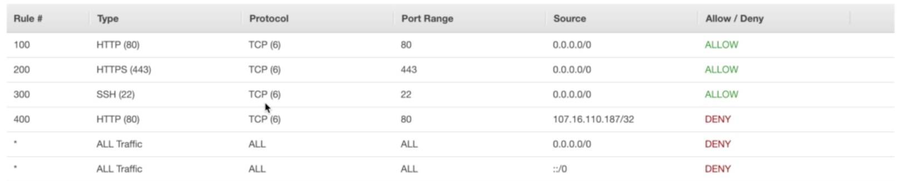
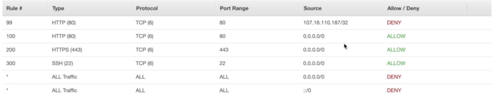
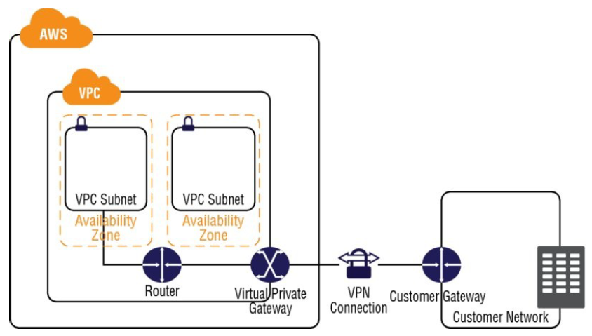

# VPC

## Features

- launch instances into a subnet
- assign custom IP ranges in each subnet
- configure route tables between subnets
- attach internet gateway to VPC
- better security control over aws resources
- instance security groups
- subnet network access control lists (ACLS)
- consists of IGWs (Virtual Private Gateways), Route Tables, Network Access Control Lists, Subnets, Security Groups
- Security Groups are Statefull, Network Access Control Lists are Stateless
- 10.0.0.0/16 ⇒ 65536 IP
    - 10.0.0.0/24 ⇒ 256 IP
    - 10.0.1.0/28 ⇒ 16 IP
- create a VPC ⇒ default Route Table, Network ACL, Security Group is automatically created. (subnet, internet gateway isn't created)
- us-east-1a in your AWS account is different to us-east-1 in another account (the AZ's are randomized)
- AWS reserve 5 IP within a subnet (you cannot use those)
- n Subnet → 1 AZ (~~n AZ → 1 subnet~~)
- 1 Internet Gateway ↔ 1 VPC
- n Security Group → 1 VPC  (~~1 Security Group → n VPC~~ )

## Default VPC vs Custom VPC

- default VPC is user friendly, allowing you to immediately deploy instances
- All Subnets in default VPC have a route out to the internet
- Each EC2 instance has both public and private IP address

## VPC Peering

- allow to connect 1 VPC with another via a direct network route using private IP addresses
- instances behave as if they were on the same private network
- can peer VPC's with other AWS account or other VPCs in the same account
- 1 central VPC peers with 4 others. **NO TRANSITIVE PEERING**
- can peer between regions

## Network Address Translation (NAT)

### NAT Instance

- when creating NAT Instance must disable Source/Destination Check on Instance
- NAT instances must be in a public subnet
- must route traffic of private subnet to NAT instance
- amount of traffic that NAT instance can support depends on instance spec (CPU, RAM, storage...)
- can create high availability using Autoscaling Groups, multiple subnets in different As, and a script to automate failover
- Behind a Security Group

### Nat Gateways

- 1 NAT Gateway → 1 AZ (n NAT Gateway → 1 AZ ?)
- preferred by the enterprise
- start with throughput at 5Gbps, scale currently to 45Gbps
- No need to patch
- Not associated with security groups
- assigned a public ip address by ElasticIP
- remember to update route tables
- no need to disable Source/Destination Checks
- if you have resource in multiple AZs and they share one NAT gateway, if NAT Gateway's AZ is down, resources in the other AZs lose internet access. To create an AZ-independent architecture, create a NAT gateway in each AZ and configure your routing to ensure that resources use the NAT gateway in the same aZ

## Network Access Control List (ACL)

### Ephemeral Port

[Ephemeral Port](https://en.wikipedia.org/wiki/Ephemeral_port): Client decide the port to communication with server (TCP, UDP, SCTP). The server allocate automatically from a predefined range. The allocations are temporary and only valid for the duration of the communication session. After completion of the communication session, the ports become available for reuse.

- if a request comes into a web server in your VPC from a client on the internet, your network ACL must have an outbound rule to enable traffic destined for ephemeral ports.
- If an instance in your VPC is the client initiating a request, your network ACL must have an inbound rule to enable traffic destined for the ephemeral ports.

The range varies depending on the client's operating system.

- Many Linux kernels (including the Amazon Linux kernel) use ports 32768-61000.
- Requests originating from Elastic Load Balancing use ports 1024-65535.
- Windows operating systems through Windows Server 2003 use ports 1025-5000.
- Windows Server 2008 and later versions use ports 49152-65535.
- A NAT gateway uses ports 1024-65535.
- AWS Lambda functions use ports 1024-65535.
- In practice, to cover the different types of clients that might initiate traffic to public-facing instances in your VPC, you can open ephemeral ports **1024-65535.**

[Read more](https://docs.aws.amazon.com/vpc/latest/userguide//vpc-network-acls.html#nacl-ephemeral-ports)

### Tips

- subnets are assigned to default network ACL by default
- default Network ACL allows all outbound and inbound traffic by default
- By default, each custom Network ACL denies all in bound and outbound traffic until you add rules
- Block IP Addresses, port using Network ACLs not Security Groups
- n Subnets → 1 Network ACL (~~n Network ACL → 1 Subnet~~) (When you associate a network ACL with a subnet, the previous association is removed)
- Network ACLs contain a numbered list of rules that is evaluted in order starting with the lowest numbered rule

    

    107.16.110.187 IP is not denied

    

    107.16.110.187 IP is denied

- Network ACLs have separate inbound and outbound rules, each rule can either allow or deny traffic (stateless >< security group - statefull)

## Flowlog

- cannot enable flow logs for VPCs that are peered with your VPC unless the peer VPC is in your account
- cannot tag a flow log
- after you've created a flow log, you cannot change its configuration, for example you can't associate a different IAM role with the flowlog
- Not all IP traffic is monitored
    - traffic generated by instances when they contact the Amazon DNS server. If you use your own DNS server, then all traffic to that DNS server is logged
    - traffic generated by a Windows instance for Amazon Windows license activation
    - traffic to and from 169.254.169.254 for instance metadata
    - DHCP traffic
    - traffic to the reserved IP address for the default VPC router

## Bastion host

- NAT Gateway or NAT instance is used to provide internet traffic to EC2 instances in private subnets
- A Bastion is used to securely administer EC2 instances (USing SSH or RDP). Bastions are called JUmp Boxes in Australia
- You cannot use a NAT Gateway as a Bastion host

## Direct connect

- Direct Connect directly connects your data center to AWS
- Useful for high throughput workloads
- a stable and reliable secure connection

## VPC Endpoint

- enable you to privately connect your VPC to supported AWS services and VPC endpoint services powered by PrivateLink without requiring an internet gateway, NAT device, VPN connection, or AWS Direct Connect connection
- instances in the VPC do not require public IP to communicate with resources in service
- traffic between your VPC and the other service does not leave the Amazon network
- 2 types:
    - Interface Endpoints
    - Gateway Endpoints (S3, DynamoDB)

## Elastic IP Addresses (EIPs)

- AWS mainatins a pool of public IP addresses in each region, you can allocate EIP to your account and release
- n EIP → 1 region (~~n region → 1 EIP~~)
- 1 network interface (find in EC2 place) ↔ 1 EIP
- there are charges for EIPs allocated to your account, even they are not associated with a resource

## Virtual Private Gateways (VPGs), Customer Gateways (CGWs), Virtual Private Networks (VPNs)

